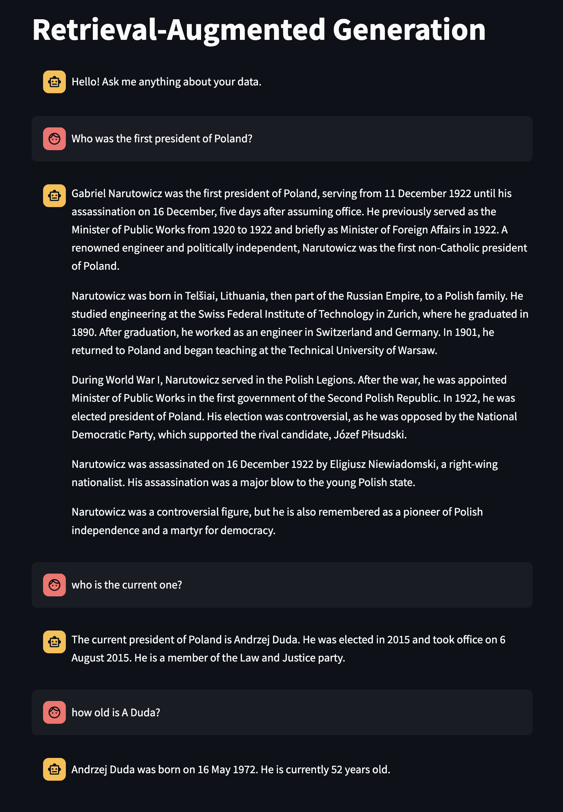

# Project Description
This project is a Python-based application that utilizes the RAG (Retrieval-Augmented Generation) model for question answering tasks. RAG combines pre-trained sequence-to-sequence models with a dense retrieval component, making it a powerful tool for tasks like question answering. The model retrieves relevant documents from a corpus and generates an answer based on the retrieved documents and the original query. Additionally, this project allows you to scrape webpages to gather knowledge for the RAG model.

# File Structure
- `./scripts/scraper.py`: A scraper for web pages.
- `./scripts/rag/rag.py`: Contains the implementation of the RAG model. RAG utilizes the [Pinecone VectorStore](https://www.pinecone.io/) and the [PaLM model](https://research.google/blog/pathways-language-model-palm-scaling-to-540-billion-parameters-for-breakthrough-performance/?_gl=1*xss1ao*_ga*NzkyNTA5ODQ2LjE3MTY5ODEzMzU.*_ga_KFG60X3H7K*MTcxNzAwMjQ4MS4yLjAuMTcxNzAwMjQ4NS4wLjAuMA..) to generate answers from internal knowledge. Both Pinecone and the PaLM model are free to use. You only need to generate API keys (which are also free).
- `./notebooks/Poland_presidents_example.ipynb`: An example of how to use the RAG model. The source of internal knowledge in this example is Wikipedia pages about Polish presidents.
- `streamlit_app.py` - An interface of RAG utilizing streamlit

# User Interface

Streamlit provides a user-friendly interface to interact with the RAG model. 

The example of conversation:

# How to Run
1. Install the required Python packages by running the following command:\
`pip install -r requirements.txt`
2. Generate a [Google API key](https://aistudio.google.com/app/apikey) and a [Pinecone API key](https://docs.pinecone.io/guides/get-started/quickstart). Replace the keys in the `.env` file with your own keys.
3. To run streamlit app, your Pinecone database needs to consist any documents. To add documents, you can run section `Create database` inside `Poland_presidents_example.ipynb`. Later, run the command: `streamlit run streamlist_app.py` to generate UI for RAG. Provide UI with name of your Pinecone database and api keys.
 
Feel free to explore the `Poland_presidents_example.ipynb` notebook and streamlit app. It can serve as an inspiration for writing your own RAG model!